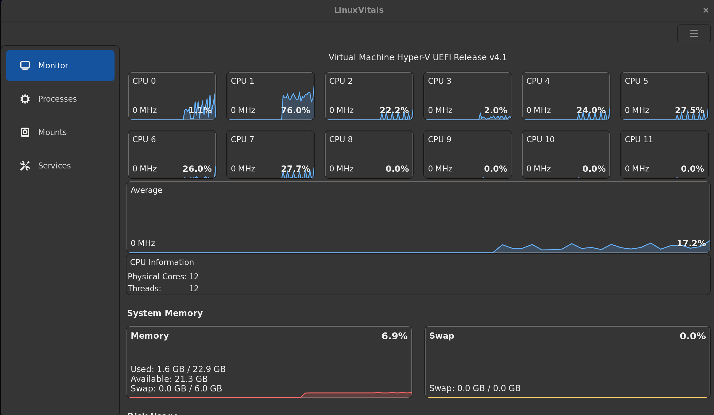

# LinuxVitals CPU Monitoring and Control Application


LinuxVitals is a GUI application that allows you to monitor and control various aspects of the CPU on Linux systems.
This project is in early development so some things might not work as expected.

## Features

- **Real-time CPU Monitoring:** 
* Current CPU frequency per thread and average,
* Current CPU load per thread and average,
* Package temperature,
* Current selected governor



- **Control CPU:** 
* Adjust CPU the minimum and maximum frequencies,
* Select governor,
* Toggle boost,
* Change TDP,
* Set AMD Ryzen PBO offset curve
* Set Intel Energy Performance Bias

## Getting Started

Simply clone the repository with,

```sh
git clone https://github.com/Neol00/LinuxVitals.git
```

then run,

```sh
cd LinuxVitals
```

```sh
chmod +x ./install.sh
```

```sh
./install.sh
```

or run the application directly with.

```sh
python launch.py
```

You could also download one of the release package files, though cloning the repository is generally recommended.

On initial launch, the application generates a `config.ini` file within the `.config` folder of your home directory. This file contains tunable settings that can be adjusted either directly within the `config.ini` file or through the application interface.

The application dynamically searches for system-specific CPU files to access and modify. It saves the directories and files to a JSON cache file located in the `.cache` folder of your home directory. If this cache file exists, the application will bypass the search and utilize the cache to reduce unnecessary CPU usage. Should you encounter issues, manually deleting the cache file will force the application to perform a new search.

If you want the settings to be applied automatically on subsequent system startups, enable the "Apply on Boot" option in the settings window. This option is only available after you have applied a setting, as it will only activate the settings you have specifically modified. This option creates a systemd service at `/etc/systemd/system/linuxvitals.service` and a complementary script at `/usr/local/bin/apply_linuxvitals_settings.sh`, which includes the commands necessary to apply the set settings. If you wish to disable and remove the service and script, simply deactivate the "Apply on Boot" option or do so manually.

## Prerequisites

What things you need to run the application and how to install them:

* python
* gtk4
* polkit
* gobject-introspection
* python-gobject
* ryzen_smu (for AMD Ryzen CPU's full functionality)

Arch Linux:

```sh
sudo pacman -Sy --needed python gtk4 polkit gobject-introspection python-gobject
```

If you are using a AMD Ryzen CPU i recommend that you download and install ryzen_smu manually from:
```sh
https://github.com/leogx9r/ryzen_smu
```

## License

This application is licensed under the GPLv3 License - see the LICENSE file for details.

## Support

For support or other inquiries, email: noelejemyr@protonmail.com
